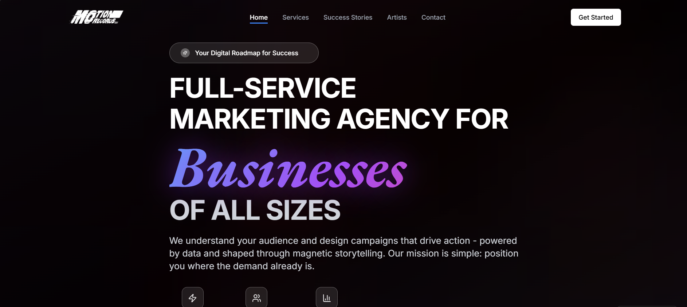

# 🎯 MotionRecords - Marketing Agency Website

Welcome to **MotionRecords** — a sleek and modern marketing agency website built to showcase services, campaigns, and client success stories. This site is fully responsive and designed to provide an engaging user experience across all devices.



## 🌐 Live Site

🔗 [Visit the Live Website](https://v0-motionrecords-ruddy.vercel.app/)  

---

## 🛠️ Tech Stack

- **Frontend:** HTML5, CSS3, JavaScript
- **Framework :** React / Next.js / Tailwind CSS *(based on your setup)*
- **Deployment:**GitHub Pages

---

## ✨ Features

- ⚡ Clean & modern landing page
- 💼 Services section with icons and descriptions
- 📈 Portfolio or case studies with interactive cards
- 🧑‍💼 About the team / agency mission
- ✉️ Contact form with email integration (e.g., Formspree)
- 📱 Mobile-responsive layout
- 🌙 Optional dark/light mode toggle

---

## 📁 Folder Structure

```bash
motionrecords/
├── public/
│   └── assets/ (images, icons, logos)
├── src/
│   ├── components/ (Navbar, Footer, Services, etc.)
│   ├── pages/ (Home, About, Contact)
│   └── styles/ (CSS or Tailwind classes)
├── README.md
└── index.html / main.jsx / app.js (based on stack)
